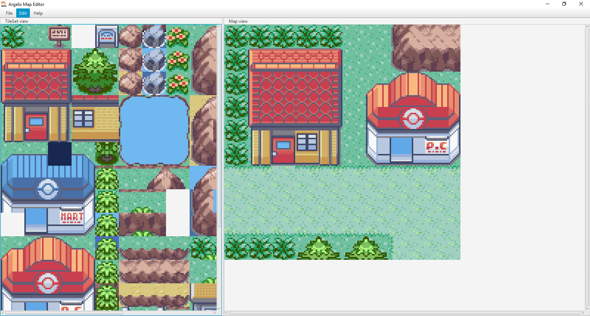
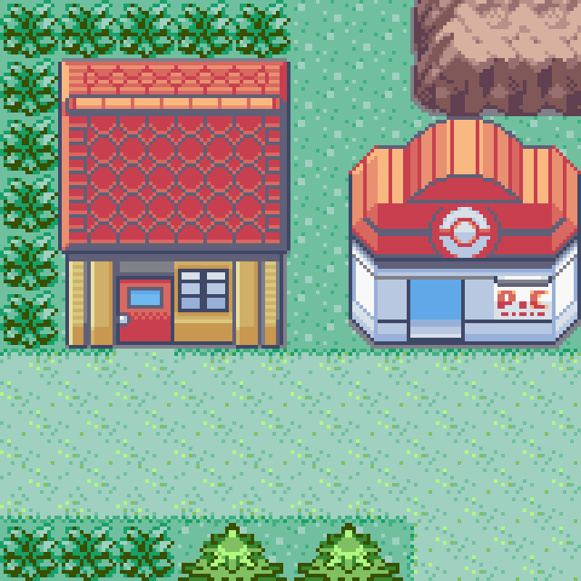
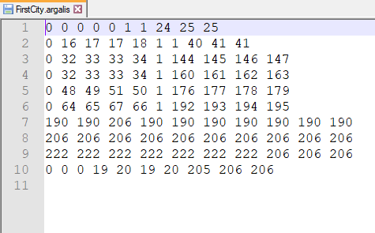

<h1 align="center">
     
      
     
      ArgalisMap_Editor
     
</h1>

  
  

Map editor for 2D Games
- using Netbeans IDE (first time)
- using Java 8.0
- using JavaFX & Scene Builder

<h2 align="center">
     
      Application full screen exemple :
     
     
      
     
</h2>

<h2 align="center">
     
      You can save it as a png, gif, jpg, jpeg file format :
     
     
      
     
</h2>

<h2 align="center">
     
      For memory sake you can also save it as an '.argalis' file :
     
     
      
     
</h2>
